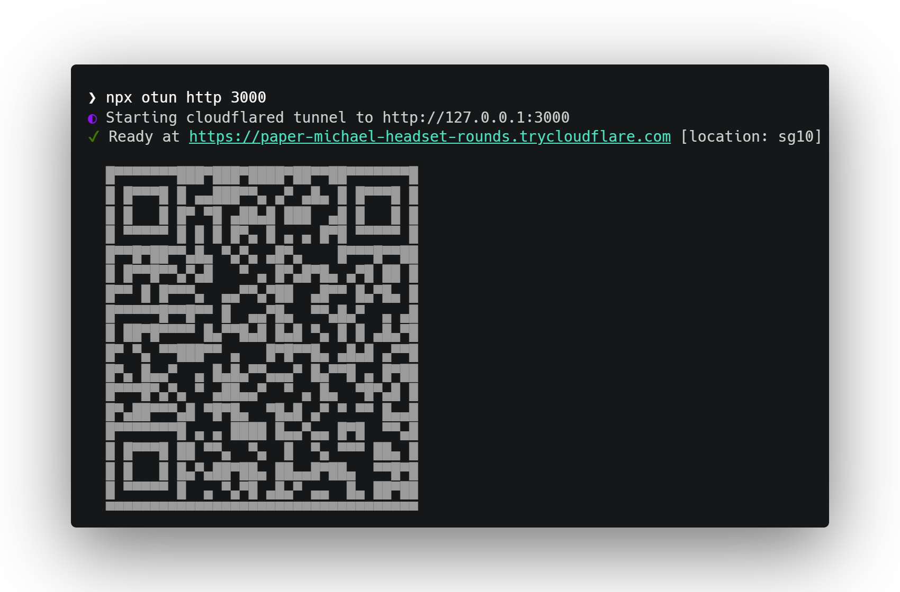

# otun [![npm version][npm-version-src]][npm-version-href]

CLI to expose your local HTTP(s) server to the internet for free. Powered by [Cloudflare Quick Tunnels](https://developers.cloudflare.com/cloudflare-one/connections/connect-networks/do-more-with-tunnels/trycloudflare/).

Inspired by [unjs/untun](https://github.com/unjs/listhen), and based on efforts from [node-cloudflared](https://github.com/JacobLinCool/node-cloudflared)

<div align="center">

</div>

## Usage

View usage info `npx otun --help`.

```sh
# npx
npx otun http 3000

# Install globally
npm i -g otun
otun http 3000

# Arguments
otun [protocol] [port]
```

## Development

- Clone this repository
- Install latest LTS version of [Node.js](https://nodejs.org/en/)
- Enable [Corepack](https://github.com/nodejs/corepack) using `corepack enable`
- Install dependencies using `pnpm install`
- Run interactive tests using `pnpm dev`

## License

Made with 💛

Published under [MIT License](./LICENSE).

<!-- Badges -->

[npm-version-src]: https://img.shields.io/npm/v/otun?style=flat&colorA=18181B&colorB=F0DB4F
[npm-version-href]: https://npmjs.com/package/otun
